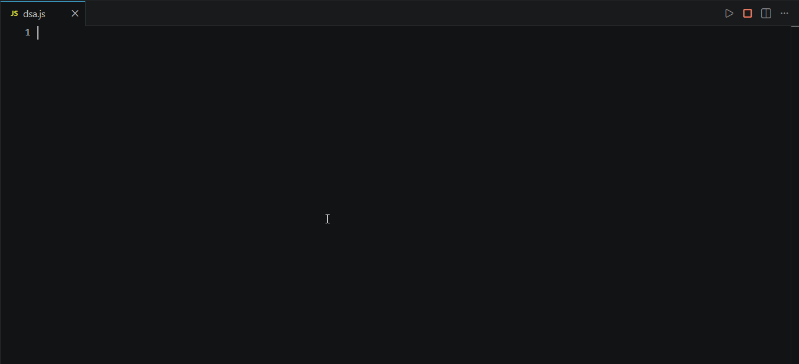

# ⚡ CODEWiz VS Code Extension 🧙‍♂️

<p align="center">
  <a href="https://github.com/rayan-dev0/CODEWiz/releases">
    
  </a>
  
  
  
</p>

---

**CODEWiz** is a fast, responsive VS Code and VSCodium extension that executes JavaScript files in a secure background runner, traces variable state changes in real-time, and displays the transitions directly inline as editor decorations.



---

## 🌟 Key Features

- **🎨 Instant Inline Visuals:** See variables mutate as they transition (e.g. `nums: [1] → [1, 0] → [1, 0, 1]`) directly on the right side of the active statement.
- **🔍 Smart Filter Mode:** Traces lines ending with `//?` selectively if they exist (displaying values using a sleek `=>` prefix), or traces all lines by default (displaying values using a standard `//` comment prefix).
- **📦 Deep Collection Serialization:** Custom cloner safely serializes `Map` and `Set` collections, resolves circular references, and truncates large arrays (e.g. `[1, 2, 3, ... (10 items)]`) to keep your editor clean.
- **🚀 Automatic Runtime Detection:** Runs code using **Bun** (prefers Bun for sub-millisecond execution speeds) with automatic fallback to **Node.js** if Bun is not available.
- **🛡️ Execution Safety Guardrails:**
  - **Loop Limit:** Execution processes are capped at a strict 2-second timeout to safely terminate infinite loops.
  - **Memory Safeguards:** Max limit of `1000` overall traces and `20` records per statement to prevent memory exhaustion and editor lag.
  - **Concurrent Cancellation:** Kills stale background processes immediately upon a new save or execution trigger.
- **❌ Inline Error Highlighting:** Catches execution syntax or runtime errors and overlays a bold red warning comment (e.g. `// ❌ Error: <message>`) at the exact line of the failure.

---

## 🚀 How to Use

### 🎮 Enable Tracing

1. Open any JavaScript file (`.js`, `.mjs`).
2. Press the **Play (`▶`)** icon in the editor title bar (top right corner) or use the keyboard shortcut **`Ctrl + Alt + T`** (macOS: **`Cmd + Alt + T`**).
3. Modifying and saving the file will automatically update the inline decorations.

### 🛑 Disable Tracing

- Press the red **Stop (`■`)** icon in the editor title bar or use the keyboard shortcut **`Ctrl + Alt + C`** (macOS: **`Cmd + Alt + C`**) to disable tracing and clear all active decorations.

---

## 📥 Installation

You can download the extension package and install it manually:

<p align="center">
  <a href="https://github.com/rayan-dev0/CODEWiz/releases">
    
  </a>
</p>

1. Download the latest `.vsix` file (e.g., `codewiz-x.y.z.vsix`) from the releases page above.
2. In VS Code, open the Extensions view (`Ctrl+Shift+X` or `Cmd+Shift+X`).
3. Click the `...` (More Actions) button in the top right corner of the Extensions view, select **Install from VSIX...**, and choose the downloaded file.

---

## ⚙️ Configuration Settings

Customize the behavior of the extension via standard VS Code settings (`Ctrl+,` or `Cmd+,`):

| Setting                  | Type      | Default   | Description                                                                                                                    |
| :----------------------- | :-------- | :-------- | :----------------------------------------------------------------------------------------------------------------------------- |
| `codewiz.runOnSave`      | `boolean` | `true`    | Automatically runs the tracer when you save a JavaScript file.                                                                 |
| `codewiz.runtime`        | `string`  | `"auto"`  | Select runtime: `"auto"` (prefers Bun, fallback Node), `"bun"`, or `"node"`.                                                   |
| `codewiz.timeout`        | `integer` | `2000`    | Process execution timeout in milliseconds.                                                                                     |
| `codewiz.maxTotalTraces` | `integer` | `1000`    | Maximum trace events collected in a single run (safeguard).                                                                    |
| `codewiz.maxLineTraces`  | `integer` | `20`      | Max trace events logged for a single statement to avoid clutter.                                                               |
| `codewiz.traceMode`      | `string`  | `"smart"` | Tracing coverage: `"smart"` (only traces `//?` lines if any exist, otherwise all lines), `"comment"` (only `//?`), or `"all"`. |
| `codewiz.showRawInHover` | `boolean` | `false`   | Show a collapsible section with the raw trace JSON at the bottom of the hover cards.                                           |

---

## 🛠️ Local Development & Setup

If you want to compile and modify the extension locally:

### 📋 Prerequisites

- [Bun](https://bun.sh/) (recommended) or Node.js.

### ⚙️ Steps

1. Clone or open this repository in VS Code/VSCodium.
2. Install dependencies:
   ```bash
   bun install
   # or
   npm install
   ```
3. Compile & Bundle the extension:
   ```bash
   bun run package
   # or
   npm run package
   ```
4. Press **`F5`** (or go to the **Run and Debug** view and select **"Run Extension"**) to open a new Extension Development Host window.
5. In the new window, open any JavaScript file and test the inline tracing.

---

## 📄 License

This project is licensed under the [MIT License](LICENSE).
